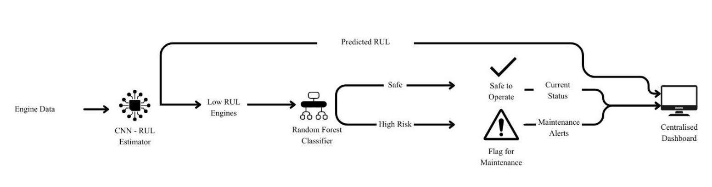

# Predictive Maintenance of Aircraft Engines using Machine Learning

A machine learning-based predictive maintenance system for aircraft engines that estimates **Remaining Useful Life (RUL)** using a **Convolutional Neural Network (CNN)** and classifies engine health using a **Random Forest** classifier. The predictions are visualized through an interactive **Streamlit dashboard**, enabling proactive maintenance planning and improved operational reliability.

---

## Overview

Aircraft engine maintenance has traditionally relied on fixed maintenance schedules, often leading to unnecessary servicing or unexpected failures. This project presents a data-driven predictive maintenance framework that combines deep learning and machine learning to estimate the Remaining Useful Life (RUL) of aircraft engines and identify engines requiring maintenance.

The system follows a two-stage prediction pipeline where a CNN predicts the RUL of each engine, and engines with low predicted RUL are further analyzed using a Random Forest classifier to determine their operational health status. The final predictions are displayed through an interactive Streamlit dashboard for easy monitoring and decision-making.

---

## Key Features

- Remaining Useful Life (RUL) prediction using Convolutional Neural Networks
- Engine health classification using Random Forest
- Time-series sensor data preprocessing and feature engineering
- Interactive Streamlit dashboard
- Engine-wise health monitoring
- Maintenance alerts for critical engines
- RUL trend visualization

---

## Dataset

The project utilizes the **Aviation Maintenance Dataset** derived from the **National General Aviation Flight Information Database (NGAFID)**. The dataset contains real-world flight sensor measurements, engine operational parameters, maintenance records, and flight metadata. It supports predictive maintenance tasks by providing multivariate time-series data collected from aircraft operations. :contentReference[oaicite:0]{index=0}

The preprocessing pipeline includes:

- Missing value handling
- Label Encoding
- Feature Selection
- Min-Max Scaling
- Time-series sequence generation

---

## Methodology

The predictive maintenance framework follows the architecture shown below.

  

The workflow consists of the following stages:

1. Aircraft engine sensor data is collected and preprocessed.
2. A Convolutional Neural Network predicts the Remaining Useful Life (RUL) of each engine.
3. Engines with low predicted RUL are passed to a Random Forest classifier.
4. The classifier categorizes engines as **Safe** or **High Risk**.
5. The results are displayed on a centralized Streamlit dashboard with maintenance alerts and engine health information.

---

## Machine Learning Models

### Convolutional Neural Network (CNN)

The CNN model is responsible for predicting the Remaining Useful Life (RUL) of aircraft engines from multivariate sensor data. It consists of multiple Conv1D layers, Batch Normalization, Max Pooling, Global Average Pooling, Dense layers, and Dropout for robust feature extraction and regression.

### Random Forest

The Random Forest classifier is applied only to engines with low predicted RUL. It classifies engines into:

- Good
- Critical

This two-stage approach improves maintenance decision-making by focusing classification on high-risk engines.

---

## Dashboard

The Streamlit dashboard provides:

- Total number of monitored engines
- Number of critical engines
- Average Remaining Useful Life
- Engine status table
- Engine search functionality
- Remaining Useful Life trend visualization

---

## Results

The proposed two-stage framework combines deep learning and machine learning to improve predictive maintenance performance.

For Remaining Useful Life prediction, the **Convolutional Neural Network (CNN)** achieved the best regression performance among the evaluated models, demonstrating lower prediction error and better generalization. For engine health classification, the **Random Forest** classifier provided the most balanced performance in terms of precision, recall, F1-score, and overall reliability. These findings support the selection of CNN for RUL estimation and Random Forest for maintenance decision-making. :contentReference[oaicite:1]{index=1}

The generated predictions are visualized through an interactive Streamlit dashboard, allowing users to monitor engine health, identify critical engines, and support proactive maintenance planning.

---

## Future Scope

- Real-time IoT sensor integration
- Cloud deployment
- REST API for model inference
- Explainable AI (XAI) integration
- Fleet-wide monitoring dashboard
- Automated maintenance scheduling
